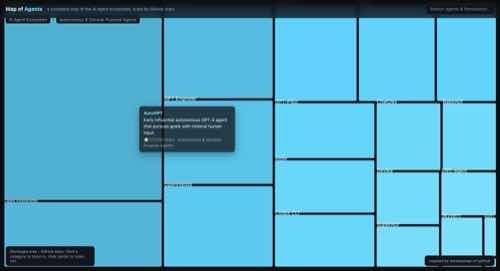

# Map of Agents

A zoomable map of the AI agent ecosystem — frameworks, autonomous agents, protocols,
memory/retrieval, evaluation & observability, coding agents, and multi-agent research —
with each project's rectangle sized by its GitHub star count.

Inspired by [anvaka/map-of-github](https://github.com/anvaka/map-of-github) ([live demo](https://anvaka.github.io/map-of-github/)),
which maps the entire GitHub universe as a zoomable treemap. This project applies the same
idea to a single, fast-moving corner of it: AI agents.

**[Live demo →](https://shaileshjaiswalwins.github.io/map-of-agents/)** *(enable GitHub Pages on `docs/` to activate)*

## Screenshots

### Full map — 7 categories, 85 projects


### Zoomed into a category


## How it works

- **Layout**: a [D3.js](https://d3js.org/) squarified treemap (`d3.treemap` + `d3.treemapSquarify`),
  two levels deep — category → project.
- **Sizing**: each project's rectangle area is proportional to its (approximate) GitHub star count.
- **Interaction**: click a category to zoom into it and fill the viewport with its projects;
  click the background (or a breadcrumb) to zoom back out; click a project to open its GitHub repo;
  search filters projects by name; hover shows a tooltip with description, star count, and category.
- **No build step** — a single static `docs/index.html` + `docs/data.json`, so it can be hosted
  directly from GitHub Pages.

## Categories

| Category | What it covers |
|---|---|
| Agent Frameworks & SDKs | LangChain/LangGraph, CrewAI, AutoGen, Semantic Kernel, Claude Agent SDK, OpenAI Agents SDK, Google ADK, and more |
| Autonomous & General-Purpose Agents | AutoGPT, OpenHands, GPT Engineer, MetaGPT, Aider, browser-use, Cline, and more |
| Protocols, Orchestration & Infrastructure | Model Context Protocol, Agent2Agent (A2A), Ray, Temporal, E2B, CopilotKit, Composio |
| Memory, RAG & Retrieval | Mem0, Zep, Chroma, Weaviate, Qdrant, Milvus, FAISS, LiteLLM |
| Evaluation & Observability | Langfuse, Promptfoo, Ragas, DeepEval, AgentBench, Arize Phoenix, OpenAI Evals |
| Coding Agents & Dev Tools | Claude Code, Continue.dev, Bolt.new, Plandex, opencode, Sweep |
| Multi-Agent Simulation & Research | Generative Agents ("Smallville"), CAMEL, JARVIS/HuggingGPT, Voyager, Concordia |

Star counts are approximate snapshots and will drift out of date — see [Regenerating the data](#regenerating-the-data).

## Running locally

```bash
cd docs
python3 -m http.server 8080
# open http://localhost:8080
```

No dependencies, no build — it's a static page that loads `data.json` and renders with D3 from a CDN.

## Regenerating the data

`scripts/build_data.py` holds the curated project list (name, description, repo, star count) and
shapes it into the hierarchical `docs/data.json` the page consumes:

```bash
python3 scripts/build_data.py
```

To refresh star counts with live numbers instead of the curated snapshot, swap in calls to the
[GitHub REST API](https://docs.github.com/en/rest/repos/repos#get-a-repository) (`stargazers_count`)
for each `repo` field before regenerating.

## Project structure

```
map-of-agents/
├── docs/
│   ├── index.html     # the visualization (D3 zoomable treemap)
│   └── data.json       # generated dataset (category → projects)
├── scripts/
│   └── build_data.py   # curated dataset + JSON generator
└── assets/              # README screenshots
```

## Credits

- Concept and treemap approach inspired by [anvaka/map-of-github](https://github.com/anvaka/map-of-github).
- Built with [D3.js](https://d3js.org/).
