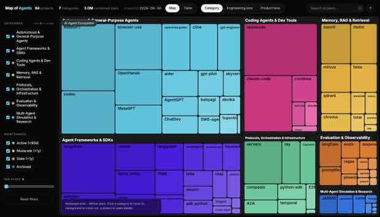
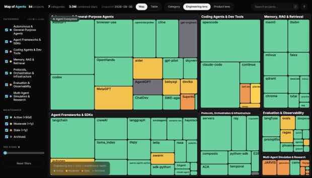
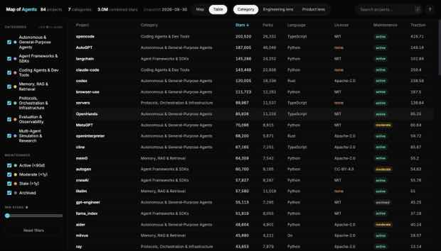

# Map of Agents

A **live, data-driven map of the AI agent ecosystem** — 84 real projects across 7 categories,
pulled fresh from the GitHub API (stars, forks, license, language, last commit), with two
purpose-built lenses so it's actually useful to the two people most likely to open it:

- **Engineering lens** — colors every project by maintenance health (active / moderate / stale /
  archived) and flags missing licenses in the table. Answers: *is this thing safe to depend on?*
- **Product lens** — colors every project by traction (stars accrued per day since creation), a
  momentum signal independent of raw star count. Answers: *what's actually gaining ground right now,
  not just what's biggest?*

Both lenses work in two views: a zoomable **treemap** (explore visually, area = stars) and a
sortable/filterable **table** (scan and compare — the view a leader making a build-vs-buy or
vendor call will actually want).

Inspired by [anvaka/map-of-github](https://github.com/anvaka/map-of-github) ([live demo](https://anvaka.github.io/map-of-github/)),
which maps the entire GitHub universe as a zoomable treemap. Map of GitHub earns that layout because
of scale — hundreds of thousands of repos where only a treemap makes bulk visible. At 84 projects,
the same layout is a nice-to-have; what makes *this* one worth opening twice is the live metrics and
the filtering underneath it.

**[Live demo →](https://shaileshjaiswalwins.github.io/map-of-agents/)**

## Screenshots

### Map view — category lens


### Map view — Engineering lens (maintenance health)
Grey = archived, orange = stale (>1yr since a commit), amber = moderate. Green dominates because
this space moves fast — but the outliers are exactly what a tech lead needs to see before adopting one.


### Table view — sortable, filterable


## What it's for

**If you're an engineering lead** evaluating what to build on: filter to "Active" maintenance,
sort the table by stars within a category, check license (flagged in orange when missing/none),
and open the detail panel for open-issue counts before you commit. The Engineering lens on the
map surfaces stale or archived dependencies at a glance — useful for a quick "are we still safe
here" pass over a stack you already adopted.

**If you're a product leader** scoping a market: switch to the Product lens to see which
categories and projects have real momentum (traction = stars/day since creation) rather than
just cumulative size, which rewards age over relevance. The category treemap sizes also show
market crowding at a glance — Agent Frameworks & SDKs and Autonomous Agents dominate; Multi-Agent
Simulation is comparatively thin, i.e. more open ground.

## How it works

- **Data**: `scripts/fetch_live_data.py` pulls live metrics for every project via the GitHub REST
  API — a hand-picked flagship list per category (`GET /repos/{owner}/{repo}`) merged with topic
  search (`GET /search/repositories?q=topic:...`) for breadth, deduped by `full_name`.
- **Shaping**: `scripts/build_data.py` turns that into the hierarchical `docs/data.json` the page
  consumes, computing `maintenance` (from days since last push) and `traction` (stars ÷ days since
  creation) for every project.
- **Rendering**: a [D3.js](https://d3js.org/) squarified treemap for the Map view; a plain sortable
  `<table>` for the Table view. Both read the same filtered/lensed dataset, so filters and search
  apply identically to either.
- **Interaction**: category → zoom in (Map) or filter (Table); click a project for a detail panel
  (stars, forks, open issues, traction, license, maintenance, last push) with a link out to GitHub;
  sidebar filters by category, maintenance status, and minimum stars; free-text search. Click a
  category's color dot to isolate it (click again to restore).
- **Onboarding**: a short spotlight tour on first visit walks through Map/Table, the two lenses,
  and the filters — skippable, and replayable anytime via the `?` button in the header.
- **Keyboard shortcuts**: `/` search, `Esc` close panel/clear search, `1`/`2` switch view, `[`/`]`
  cycle lenses. Last-used view and lens are remembered (`localStorage`) between visits.
- **No build step** — a static `docs/index.html` + `docs/data.json` styled with Tailwind (CDN) and
  D3, hosted directly from GitHub Pages.

## Categories

| Category | What it covers |
|---|---|
| Agent Frameworks & SDKs | LangChain/LangGraph, CrewAI, AutoGen, Semantic Kernel, Claude Agent SDK, OpenAI Agents SDK, Google ADK, and more |
| Autonomous & General-Purpose Agents | AutoGPT, OpenHands, GPT Engineer, MetaGPT, Aider, browser-use, Cline, Codex CLI, and more |
| Protocols, Orchestration & Infrastructure | Model Context Protocol, Agent2Agent (A2A), Ray, Temporal, E2B, CopilotKit, Composio |
| Memory, RAG & Retrieval | Mem0, Zep, Chroma, Weaviate, Qdrant, Milvus, FAISS, LiteLLM |
| Evaluation & Observability | Langfuse, Promptfoo, Ragas, DeepEval, AgentBench, Arize Phoenix, OpenAI Evals |
| Coding Agents & Dev Tools | Claude Code, opencode, Continue.dev, Plandex, Sweep |
| Multi-Agent Simulation & Research | Generative Agents ("Smallville"), CAMEL, JARVIS/HuggingGPT, Voyager, Concordia |

Numbers are a live snapshot (see `data.json`'s `meta.snapshot_date`) — see
[Refreshing the data](#refreshing-the-data) to pull current numbers.

## Running locally

```bash
cd docs
python3 -m http.server 8080
# open http://localhost:8080
```

No dependencies, no build — a static page that loads `data.json` and renders with D3 from a CDN.

## Refreshing the data

Requires the [GitHub CLI](https://cli.github.com/) authenticated (`gh auth login`) — both scripts
shell out to `gh api`, which handles auth and rate limiting for you.

```bash
python3 scripts/fetch_live_data.py   # pulls live metrics into docs/raw_live_data.json (gitignored)
python3 scripts/build_data.py        # shapes it into docs/data.json
```

`fetch_live_data.py` takes a few minutes — GitHub's search endpoint is rate-limited to 30
requests/minute, and the script paces itself accordingly. Edit the `CATEGORIES` dict in that file
to add flagship repos or new topic-search queries per category.

## Project structure

```
map-of-agents/
├── docs/
│   ├── index.html            # the visualization (D3 treemap + table, two lenses)
│   └── data.json             # generated dataset (category → projects, live metrics)
├── scripts/
│   ├── fetch_live_data.py    # pulls live GitHub metrics (search + per-repo lookups)
│   └── build_data.py         # shapes raw data into docs/data.json, computes derived signals
└── assets/                   # README screenshots
```

## Credits

- Concept and treemap approach inspired by [anvaka/map-of-github](https://github.com/anvaka/map-of-github).
- Built with [D3.js](https://d3js.org/) and the [GitHub REST API](https://docs.github.com/en/rest).
